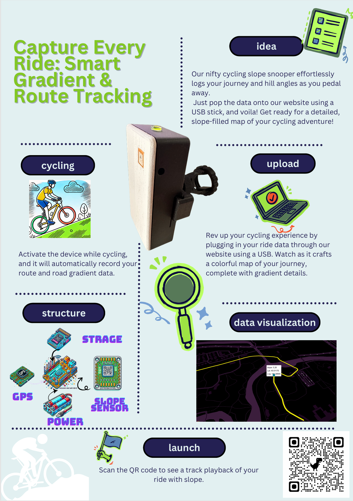
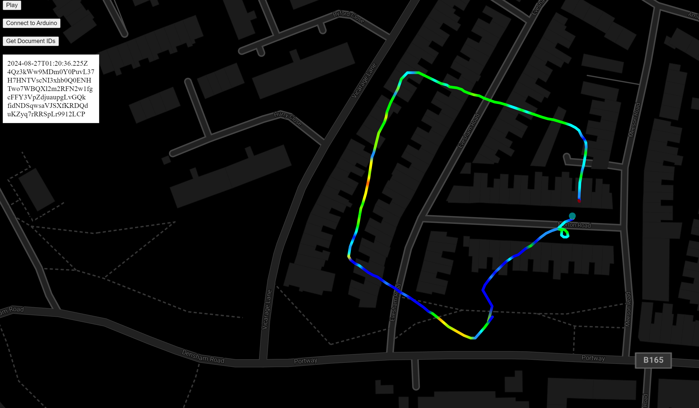
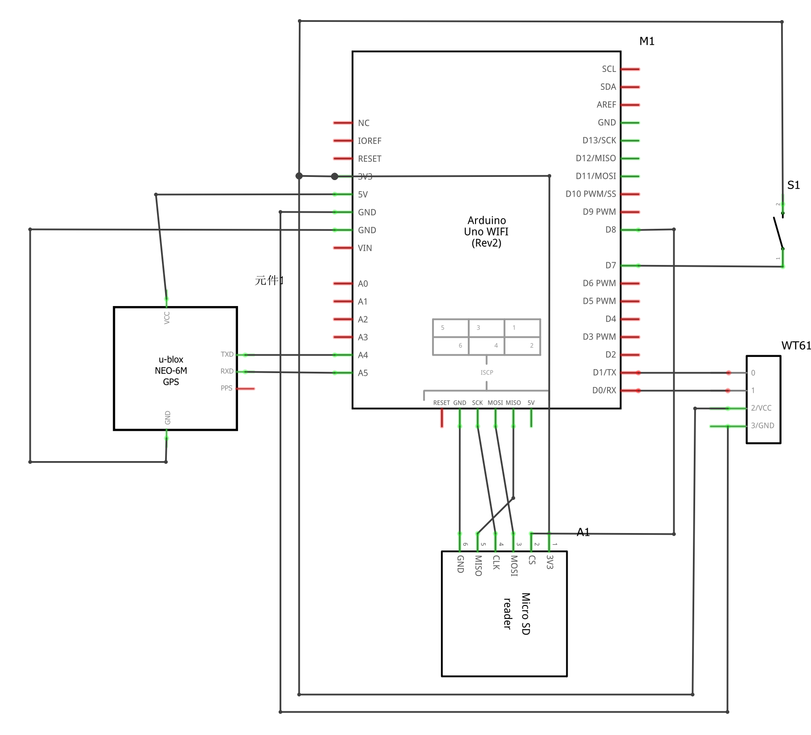
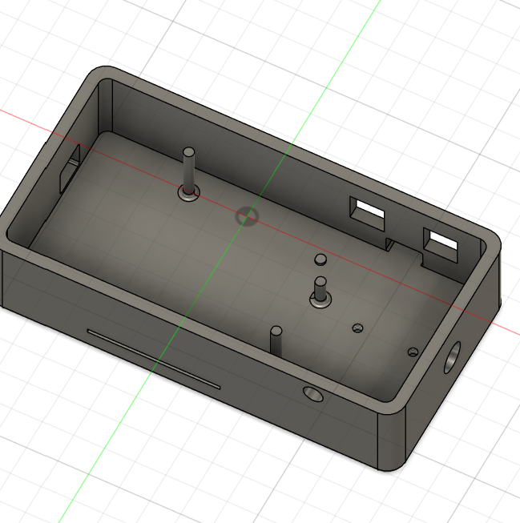
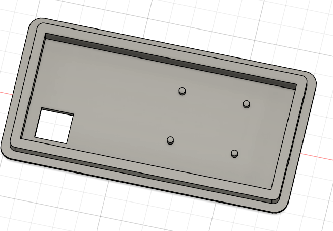

 # Real-Time Road Slope Detection System for Bicycles

This project involves the design, development, and deployment of a portable, real-time road slope detection system for bicycles. The system integrates an Arduino-based hardware setup with a web-based interface for data visualization, enabling cyclists to monitor road slopes and analyze cycling routes in real time. The primary goal of this project is to improve the cycling experience by providing accurate slope data, making it useful for urban planning, transportation safety, and personal fitness tracking.

## Table of Contents

- [Project Overview](#project-overview)
- [System Components](#system-components)
- [Setup and Installation](#setup-and-installation)
- [How It Works](#how-it-works)
- [Future Work](#future-work)
- [License](#license)

## Project Overview

This project addresses the need for high-precision road slope detection on cycling routes. The system integrates multiple hardware components, including an Arduino Uno WiFi Rev2, WT61 IMU sensor, GNSS module, and SD card storage. Data collected during cycling sessions is transmitted to a web application for real-time visualization using Azure Maps.

Here is a screenshot of the visualisation page.

Click [here](https://slopemap-13158.web.app/) to go to the visualisation page

### Research Objectives
1. **Design and integrate** a hardware system capable of detecting road gradients and GPS positions.
2. **Develop** a web-based interface for visualizing and analyzing recorded data.
3. **Establish** a secure and scalable method for storing and managing cycling data.

## System Components

The project comprises the following key components:

- **Arduino Uno WiFi Rev2**: Central microcontroller for processing and data handling.
- **WT61 IMU Sensor**: Measures acceleration, angular velocity, and slope angles across three axes with pre-processed, fused, and corrected data output.
- **GNSS Module**: Provides precise geolocation data using GPS, BeiDou, Galileo, and GLONASS for improved accuracy.
- **SD Card Module**: Stores data locally before transmission.
- **Battery Module**: Powers the system during cycling sessions.
- **Azure Maps API**: Displays the collected data on a web interface for real-time route playback.

## Setup and Installation

### Hardware Setup
1. Connect the WT61 IMU sensor, GNSS module, and SD card shield to the Arduino Uno WiFi Rev2 as the figure.

2. Power the system with a rechargeable battery module.
3. 3D print the enclosure.


4. Ensure secure mounting on the bicycle using a custom 3D-printed clamp.


The form of the assembled hardware is shown below:


### Software Setup
1. Clone this repository:
   ```bash
   git clone https://github.com/yourusername/road-slope-detection.git
   ```
2. Burn [record.ino](arduino/record.ino) into arduino uno wifi rev2

### Website setup
if you want to set up you own website please follow the insturction below.
1. ensure you have Node.js and nmp installed.
2. Install Firebase CLI globally.
```bash
nmp install -g firebase-tools
```
#### firebase setup
1. login to firebase:
```bash
firebase login
```
2. initialize Firebase in [website] directory:
```bash
firebase init
```
3. deploy frontend application:
```bash
firebase deploy --only hosting
```
4. delopying backend functions:
```bash 
cd functions
firebase deploy --only function
```

## How It Works 
the system collects data from the hardware components during cycling sessions. This data is then transimitted to the web application by serial communication, where it is visualized. The backend function handle data processing and storage, ensuring securing and scalable management of cycling data.

## future work
* Integration and miniaturisation of equipment
* Add filters to eliminate data anomalies caused by vibrations and bumps.

## License

This project is licensed under the MIT License. See the [LICENSE](LICENSE) file for details.